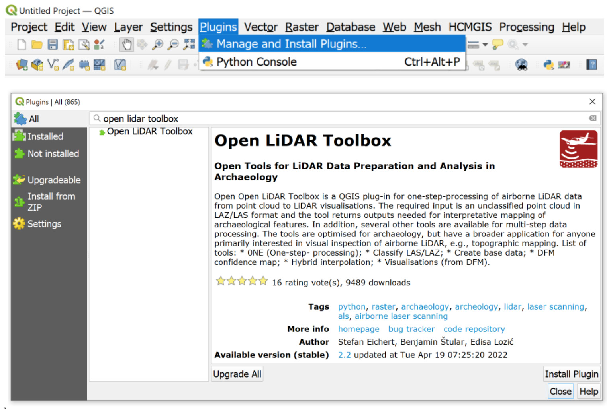
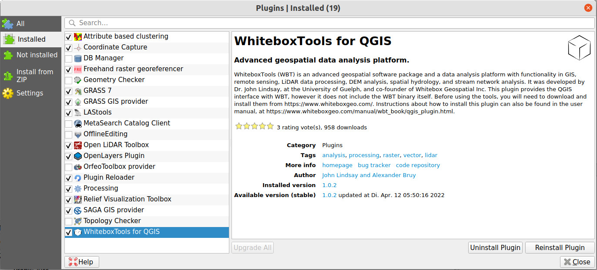
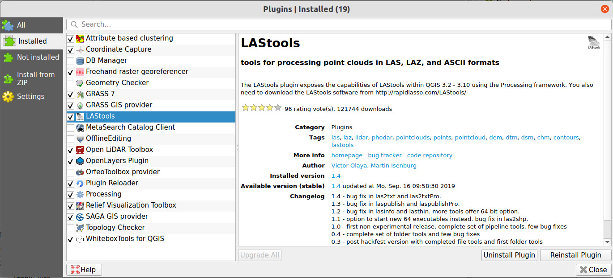
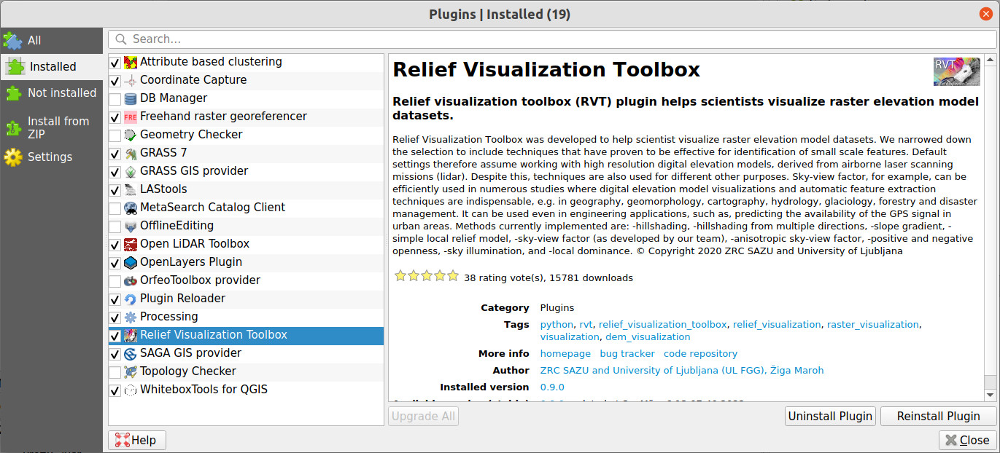
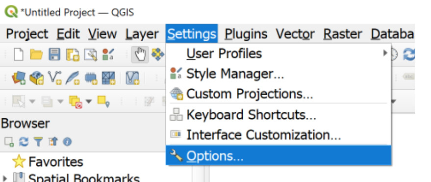
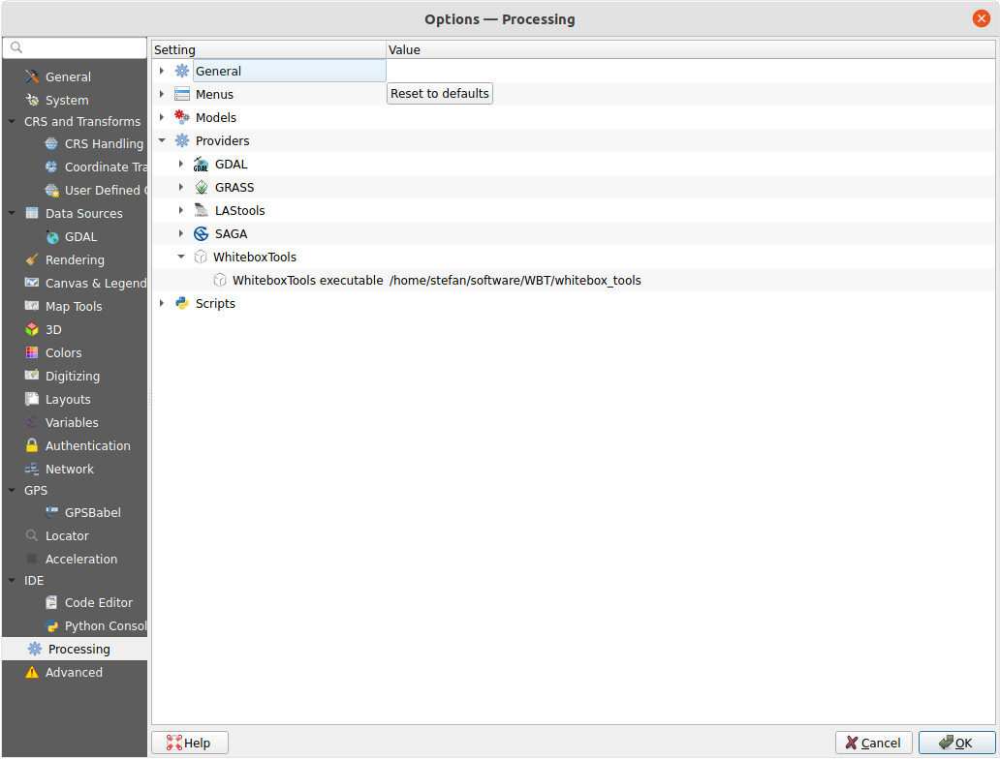
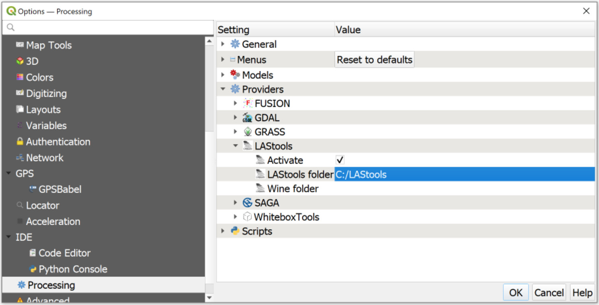

# **Open LiDAR Toolbox**

The toolbox is under active development, current version is
2.2 ( [download the plugin ZIP file](https://github.com/stefaneichert/OpenLidarToolbox/raw/main/src/QGISplugin/open_lidar_toolbox.zip "Download Plugin as ZIP")
or install from within QGIS/Plugins/Manage and Install Plugins…)

Open LiDAR Toolbox is a QGIS plug-in that provides one-step-processing of airborne LiDAR data from point cloud to LiDAR
visualisations. The input required is an unclassified point cloud in LAZ /LAS format and the tool returns several
outputs needed for interpretative mapping of archaeological features. In addition, several other tools are available for multi-step data processing. The tools are optimized for archaeology, but have
broader application for anyone primarily interested in visual inspection of airborne LiDAR data or LiDAR for topographic mapping.

Open LiDAR Toolbox is developed in collaboration between Natural History Museum Vienna, ZRC SAZU, and Graz University as a part of the MALiAp scientific
research project (ARRS N6-0132), which aims at the methodological maturity of airborne LiDAR in archaeology. The
scientific background for the toolbox is published in open access peer reviewed papers:

Štular, B.; Eichert, S.; Lozić, E. Airborne LiDAR Point Cloud Processing for Archaeology. Pipeline and QGIS Toolbox. 
Remote Sens. 2021, 16, 3225. https://doi.org/10.3390/rs13163225

Lozić, E.; Štular, B. Documentation of Archaeology-Specific Workflow for Airborne LiDAR Data Processing. Geosciences
2021, 11, 26. https://doi.org/10.3390/geosciences11010026.

Štular, B.; Lozić, E.; Eichert, S. Airborne LiDAR-Derived Digital Elevation Model for Archaeology. Remote Sens. 2021,
13, 1855. https://doi.org/10.3390/rs13091855.

Štular, B.; Lozić, E. Comparison of Filters for Archaeology-Specific Ground Extraction from Airborne LiDAR Point Clouds.
Remote Sens. 2020, 12, 3025. https://doi.org/10.3390/rs12183025.

## **Keywords**

Airborne LiDAR, airborne laser scanning (ALS), archaeology, archeology, free tools, freeware, QGIS, Phyton; Point cloud
processing, point cloud classification, ground point filtering; DEM/DTM/DFM, DFM confidence map, hybrid interpolation;
raster visualisations (sky view factor, visualization for archaeological topography, openness, difference from mean
elevation)

# **Table of Content**

- [**Installation**](#installation)
- [**Dependencies**](#dependencies)
- [**General notes on input LiDAR data**](#general-notes-on-input-lidar-data)
- [**Modules**](#modules)
    * [**ONE Step Processing**](#one-one-step-processing)
    * [**Classify LAS LAZ**](#classify-las-laz)
    * [**Create base data**](#create-base-data)
    * [**Create DFM**](#create-dfm)
    * [**DFM Confidence Map**](#dfm-confidence-map)
    * [**Hybrid Interpolation**](#hybrid-interpolation)
    * [**Visualisations from DFM**](#visualisations-from-dfm)
- [**Troubleshooting**](#troubleshooting)
- [**Roadmap**](#roadmap)

# **Installation**

If you are installing Open LiDAR Toolbox for the first time:  
 
1) Install QGIS 3.22 or a later version (It was tested on 3.22 and 3.24)  
2) Install Open LiDAR Toolbox plugin for QGIS (in QGIS go to: Plugins / Manage and Install plugins / All / Open LiDAR Toolbox / Install Plugin).

<pre>

</pre>

3) Make sure the following plugins are installed: 

<pre>

WhiteboxTools for QGIS
</pre>

<pre>

LAStools
</pre>

<pre>

Relief Visualisation Toolbox
</pre>

4) Install additional WhiteboxTools files (see instructions below).  
5) Install additional LAStools files (see instructions below).

# **Dependencies**

Open LiDAR Toolbox is a &quot;shell&quot; that uses several excellent tools under the hood: GDAL, GRASS, QGIS native
tools, LAStools, Whitebox Tools and RVT. Therefore, the following plug-ins must be installed before Open LiDAR Toolbox:
LAStools, Whitebox Tools and RVT. If you do not already have these plug-ins installed, they will be
installed automatically with Open LiDAR Toolbox. However, additional steps must be taken:

## **Whitebox tools**

For Whitebox Tools not only the plugin needs to be installed but also the binaries/executables 
for the respective operating system:

1) Download the binaries for your operating system [here](https://www.whiteboxgeo.com/download-whiteboxtools/).
2) Unzip the downloaded folder and put it somewhere safe, e.g. C:/mywhiteboxfolder/
3) In Qgis, go to Settings / Options.

<pre>

</pre>

4) Navigate to the Processing tab on the left, then double-click Providers, then double-click WhiteboxTools.
5) Navigate to the executable file "whitebox_tools" ("whitebox_tools.exe" on Windows) in your WBT folder that you downloaded in step 1.
6) Click on any other box, e.g. "Scripts", and only then click OK.
<pre>

</pre>
7) That is it, you have installed WhiteboxTools for QGIS and you can proceed with the installation of LAStools.

**If you had previous versions of Open LiDAR Toolbox installed:**  
Please note, as of February 2022, Alex Bruy is no longer distributing any of his numerous 
QGIS plugins, in protest of the war in Ukraine. In order for QGIS to work properly, 
you must remove the Alex Brury repository from the Plugin repositories 
(Plugins / Settings / Plugin Repositories / Delete). 
Then, remove the existing WhiteboxTools plugin and re-install it following the above instructions.

## **LAStools**

For LAStools not only the plugin needs to be installed but also the executables:

1) Download the LAStools software from [here](https://rapidlasso.com/lastools/) and unzip it to a permanent location, e.g. "c:/LAStools"
2) In Qgis, go to Settings / Options.

<pre>

</pre>

3) Navigate to the Processing tab on the left, then double-click Providers, then double-click LAStools.
4) Navigate to the LAStools folder that you downloded in step 1, e.g. "C:/LAStools".
5) Click on any other box, e.g. "Scripts", and only then click OK.
<pre>

</pre>

6) If you are working on Linux or Mac, you must also point to a Wine folder in order to be able to execute the windows binaries from LAStools.

# **General notes on input LiDAR data**

All tools are designed to work best with data that is in
**square tiles between one and about 25 million points**.   
**Processing time increases exponentially with the number of points**, as does the RAM memory requirement. The best
practice for processing large datasets is to split the data into overlapping tiles (e.g., 20 m overlap), batch process
the tiles, and “de-collar" (remove the overlaps) the resulting raster datasets.

# **Modules**

## **ONE (One-step-processing)**

This is an algorithm pipeline that takes an airborne LiDAR point cloud to produce all derivatives essential for
archaeology and anyone interested in visual analysis of LiDAR data or uses it for topographic mapping. The pipeline introduces several additional steps
compared to a traditional approach. The results are a moderate improvement in ground point classification (ASPRS class
2) and a significant improvement in building classification (ASPRS class 6). The latter is particularly important for a
DTM to be used for further processing. The overall improvements in the visual quality of the DFM are moderate, but still
sufficient to make the difference between a positive identification of an archaeological feature or not. DFM Hybrid
interpolation improves upon the state-of-the-art by combining the positive features of two different interpolation
techniques. The crucial element that enabled the proposed hybrid interpolator was the application of the DFM confidence
map as a segmentation key. Enhanced visualizations are a crucial step in the archaeological workflow and we have used
four of the state-of-the-art solutions available.

### **Input:**

***Input LAS/LAZ file:***  
Point cloud in LAS or LAZ format. Noise classified as ASPRS class 7 will be exempt from the processing, all other
preexisting classification will be ignored. Open LiDAR toolbox will classify this point cloud for archaeological
purposes using the LAStools plugin. If your point cloud is already classified, tick the checkbox in the dialog and the
classification will be skipped.  
**Point clouds with more than 30 million points will fail or will take very long to process.**

### **Parameters:**

***The input LAS/LAZ file is already classified***
Please tick this box, if your file (LAS/LAZ format) is already classified. If it is
not, or you are not sure, leave it blank.

***Remove low noise:***  
Please tick this box if your data suffers from unclassified low noise 
that causes the "Swiss cheese” effect (sharp holes where there are none).
This will not work for low density datasets (less than 1 ground point per m2).

***Cell Size:***  
DFM grid resolution, default value is 0.5 m. Optimal resolution for any given point cloud can be calculated with the DFM
Confidence Map tool.

***Source file coordinate system (CRS):***  
Select the Coordinate Reference System (CRS) of the input LAS/LAZ file. Make sure that the CRS is Cartesian (x and y in
meters, not degrees). If you are not sure which is correct CRS and you only need it temporary you can choose any
Cartesian CRS, for example, EPSG:8687.

### **Outputs:**

***Classified LAS/LAZ file:***  
Classified point cloud. QGIS cannot load point clouds so it must be saved as a LAZ/LAS file. Please Specify folder and
file name. Output is a LAZ/LAS point cloud classified into ground (2), low vegetation (3; 0.5-2 m), high vegetation (5;
2-100m), and buildings (6); there are also likely some points remaining that have not been classified (0).  
***DFM:***  
DFM (Digital feature model, which is a type of DEM that combines ground and buildings)    
***TLI:***  
Triangulated interpolation of DFM  
***IDW:***  
Inverse distance weighting interpolation of DFM  
***Ground Point Density***  
***Low Vegetation Density***  
***DFM CM 0.5m:***  
DFM Confidence Map for 0.5 m resolution (if other resolutions are needed – e.g., the map is either completely red or
completely blue – use the dedicated tool)  
***DFM visualisations:***  
Sky view factor  
Openness – positive  
Difference from mean elevation  
Visualisation for archaeological topography (VAT)  
Hillshade/Relief

### **References:**

Štular, B.; Eichert, S.; Lozić, E. Airborne LiDAR Point Cloud Processing for Archaeology. Pipeline and QGIS Toolbox. 
Remote Sens. 2021, 16, 3225. https://doi.org/10.3390/rs13163225

### **FAQ:**

**Q: The edges of my outputs are black/grey, what can I do?**  
A: This is due to the so called edge effect. In many steps the values are calculated from surrounding points; since at
the edge there are no surrounding points, the output values are distorted or "strange", e.g., showing as black on most
visualisations. This cannot be avoided and the only solution is to process larger area or to create overlapping mosaics.

## **Classify LAS/LAZ**

The algorithm will classify the airborne LiDAR point cloud. This process – also known as "filtering" or semantic
labeling of the point cloud – is optimized for archaeology, but is also useful for other purposes.

### **Parameters:** ##

***Remove low noise:***  
Please tick this box if your data suffers from unclassified low noise 
that causes the "Swiss cheese” effect (sharp holes where there are none).
This will not work for low density datasets (less than 1 ground point per m2).

### **Input:**

***Input LAS/LAZ file:***  
Unclassified point cloud in LAS or LAZ format. Noise classified as ASPRS class 7 will be exempt from the processing, all
other preexisting classification will be ignored.

### **Output:**

***Classified LAS/LAZ:***  
Classified point cloud. QGIS cannot load point clouds so it must be saved as a LAZ/LAS file. Please Specify folder and
file name. Output is a LAZ/LAS point cloud classified into ground (2), low vegetation (3; 0.5-2 m), high vegetation (5;
2-100m), and buildings (6); there are also likely some points remaining that have not been classified (0).

### **References:**

Štular, B.; Eichert, S.; Lozić, E. Airborne LiDAR Point Cloud Processing for Archaeology. Pipeline and QGIS Toolbox. 
Remote Sens. 2021, 16, 3225. https://doi.org/10.3390/rs13163225

### **FAQ:**

**Q: The quality of classification does not meet my expectations, how can I improve it?**  
A: This tool is a one-size-fits-all and is designed for the simplicity. As any other such tool without any user defined
parameters it is designed to produce OK results for any dataset, but will by definition never be the best possible. Feel
free to experiment with other dedicated software, e.g., LAStools or Whitebox tools.

## **Create base data**

This is a pipeline that takes an airborne LiDAR point cloud to produce rasters needed for further processing or used
directly in archaeological (or similar) workflows.

### **Inputs:**

***Input LAS/LAZ file:***  
Point cloud in LAS or LAZ format. Noise classified as ASPRS class 7 will be exempt from the processing, all other
preexisting classification will be ignored.  
Open LiDAR toolbox will classify this point cloud for archaeological purposes using the LAStools plugin. If your point
cloud is already classified, tick the checkbox in the dialog and the classification will be skipped.  
**Point clouds with more than 30 million points will fail or will take very long to process.**

### **Parameters:**

***The input LAS/LAZ file is already classified***
Please tick this box, if your file (LAS/LAZ format) is already classified. If it is
not, or you are not sure, leave it blank.

***Remove low noise:***  
Please tick this box if your data suffers from unclassified low noise 
that causes the "Swiss cheese” effect (sharp holes where there are none).
This will not work for low density datasets (less than 1 ground point per m2).

***Cell Size:***  
DFM grid resolution, default value is 0.5 m. Optimal resolution for any given point cloud can be calculated with the DFM
Confidence Map tool.

***Source file coordinate system (CRS):***  
Select the Coordinate Reference System (CRS) of the input LAS/LAZ file. Make sure that the CRS is Cartesian (x and y in
meters, not degrees). If you are not sure which is correct CRS and you only need it temporary you can choose any
Cartesian CRS, for example, EPSG:8687.

### **Outputs:**

***TLI:***  
Triangulated interpolation of DFM  
***IDW:***  
Inverse distance weighting interpolation of DFM  
***Ground Point Density***  
***Low Vegetation Density***

### **References:**

Štular, B.; Eichert, S.; Lozić, E. Airborne LiDAR Point Cloud Processing for Archaeology. Pipeline and QGIS Toolbox. 
Remote Sens. 2021, 16, 3225. https://doi.org/10.3390/rs13163225

## **Create DFM**

This is an algorithm pipeline that takes an airborne LiDAR point cloud to produce a digital feature model (DFM)
especially filtered for archaeological purposes

### **Inputs:**

***Input LAS/LAZ file:***
Point cloud in LAS or LAZ format. Noise classified as ASPRS class 7 will be exempt from the processing, all other
preexisting classification will be ignored.  
Open LiDAR toolbox will classify this point cloud for archaeological purposes using the LAStools plugin. If your point
cloud is already classified, tick the checkbox in the dialog and the classification will be skipped.  
**Point clouds with more than 30 million points will fail or will take very long to process.**

### **Parameters:**

***The input LAS/LAZ file is already classified***
Please tick this box, if your file (LAS/LAZ format) is already classified. If it is
not, or you are not sure, leave it blank.

***Remove low noise:***  
Please tick this box if your data suffers from unclassified low noise 
that causes the "Swiss cheese” effect (sharp holes where there are none).
This will not work for low density datasets (less than 1 ground point per m2).

***Cell Size:***  
DFM grid resolution, default value is 0.5 m. Optimal resolution for any given point cloud can be calculated with the DFM
Confidence Map tool.

***Source file coordinate system (CRS):***  
Select the Coordinate Reference System (CRS) of the input LAS/LAZ file. Make sure that the CRS is Cartesian (x and y in
meters, not degrees). If you are not sure which is correct CRS and you only need it temporary you can choose any
Cartesian CRS, for example, EPSG:8687.

### **Outputs:**

***DFM:***  
DFM (Digital feature model, which is a type of DEM that combines ground and buildings)

### **References:**

Štular, B.; Eichert, S.; Lozić, E. Airborne LiDAR Point Cloud Processing for Archaeology. Pipeline and QGIS Toolbox. 
Remote Sens. 2021, 16, 3225. https://doi.org/10.3390/rs13163225

## **DFM Confidence Map**

This algorithm calculates a DFM Confidence Map based on the CRAN decision tree. The confidence map is primarily used for
the quality assessment of the DFM, but can also be used to determine the optimal resolution for the DFM. Digital Feature
Model (DFM) is archaeology- specific DEM interpolated from airborne LiDAR data. This algorithm calculates DFM Confidence
Map based on the CRAN decision tree. The confidence map is primarily used for the quality assessment of the DFM, but can
also be used to determine the optimal resolution for the DFM. This algorithm can also be used to calculate the
prediction uncertainty map for any DEM, but the settings must be adjusted for cell size.

### **Inputs:**

***DEM/DFM Layer:***  
DFM (or any DEM) with cell size 0.5m in raster format.

***Ground Point Density Layer:***  
Point density layer of ground (ASPRS class 2) and building (ASPRS class 6) points in raster format. Recommended cell
size is 0.5 or 1.0 m. (Whitebox Tools / LidarPointDensity can be used to calculate this layer from a LAS file).

***Low Vegetation Density Layer:***  
Point density layer of low vegetation (ASPRS standard LIDAR point class 3, height 0.5-2.0 m) in raster format.
Recommended cell size is 0.5 or 1.0 m. (Whitebox Tools / LidarPointDensity can be used to calculate this layer from a
LAS file).

### **Parameters:**

***Resolution:***  
DFM/DEM Resolution (multiple choice).

***Output Cell Size:***  
Define the cell size of the Confidence Map. 0.5 or 1 m is recommended. (It is possible to calculate DFM Confidence Map
for high resolution, e.g. 0.25 m, but display the result at lower resolution, e.g. 1 m.)

### **References:**

Štular, B.; Lozić, E.; Eichert, S. Airborne LiDAR-Derived Digital Elevation Model for Archaeology. Remote Sens. 2021,
13, 1855. https://doi.org/10.3390/rs13091855.

### **FAQ:**

**Q: I have NoData holes in my DFM/DEM**  
A: Wherever one of the inputs has a NoData value, the algorithm will return NoData. Common sources for NoData are too
low radius setting for IDW.

## **Hybrid Interpolation**

This algorithm calculates a hybrid interpolation of DFM/DEM. It uses IDW (Inverse Distance Weighing) interpolation in
areas of low DFM confidence (levels 1-3) and TLI ( Triangulation with Linear Interpolation) interpolation in areas of
high DFM confidence (levels 4-6). The user provides DFM confidence map, TLI and IDW. The module works best when TLI and
IDW are calculated under very similar conditions, such as those provided by Golden Software Surfer. This interpolator is
best suited for low or medium point density data characterized by significant local variation in point density, such as
an open landscape interspersed with hedgerows or other patches of dense vegetation. For high point density data, the TLI
by itself usually gives better results.

### **Inputs:**

***DFM Confidence Map:***  
Must be calculated with DFM Confidence Map module from IDW interpolation for the desired cell size.

***IDW Interpolation:***  
Input DFM/DEM interpolated with IDW (Inverse Distance Weighing). (Open LiDAR Toolbox / Create base data or Whitebox
Tools / LidarIDWInterpolation or Golden Software Surfer can be used to calculate this layer from a LAS file.)
Alternatively, any interpolator deemed to be most suitable for undersampled areas can be used.

***TLI Interpolation:***  
Input DFM/DEM interpolated with TLI ( Triangulation with Linear Interpolation). (Open LiDAR Toolbox / Create base data
or Whitebox Tools / LidarTINGriddin or Golden Software Surfer can be used to calculate this layer from a LAS file.)
Alternatively, any interpolator deemed to be most suitable for properly sampled and oversampled areas can be used.

### **Parameters:**

***Cell Size:***  
The resolution or cell size of the final DFM/DEM. For best results, all inputs should have the same cell size.

***Grow Radius (Cell Size):***    
Grow radius for "RED" areas with low DFM confidence will increase (grow) the areas where IDW is used. Tweak this setting
if you notice unwanted interpolation artefacts (noise) in contact areas between TLI and IDW.

")  
correct radius (3)

")  
wrong radius (1)

### **References:**

Štular, B.; Eichert, S.; Lozić, E. Airborne LiDAR Point Cloud Processing for Archaeology. Pipeline and QGIS Toolbox. 
Remote Sens. 2021, 16, 3225. https://doi.org/10.3390/rs13163225

### **FAQ:**

**Q: I have NoData holes in my DFM/DEM.**  
Wherever one of the inputs has a NoData value, the algorithm will return NoData. Common sources for NoData are too low
radius setting for IDW or too small setting for maximum triangle size in TLI.

The artifacts (noise) in the contact areas are too big and tweaking the Grow radius doesn't help. Some amount of
artifacts is inevitable. In our testing the artifacts were significantly smaller when the input layers have been
calculated with Golden Software Surfer, since exactly same parameters for neighborhood search can be set. If the
artifacts are so strong, that they can misguide archaeological interpretation, then we suggest using IDW interpolation
instead.

## **Visualisations from DFM**

This algorithm takes a digital feature model (DFM, which is archaeology-specific DEM) or any DEM to produce the most
commonly used archaeological visualisations.

### **Inputs:**

***DFM/DEM:***  
DFM or DEM in any raster format supported by QGIS, e.g., GeoTIFF.

### **Outputs:**

***VAT:***  
Visualisation for archaeological topography  
***SVF:***  
Sky view factor  
***Opennes:***  
Openness – positive  
***DME:***  
Difference from mean elevation  
***Hillshade:***  
Hillshade/Relief shading

### **FAQ:**

**Q: The edges of my outputs are black/grey, what can I do?**  
A: This is due to the so called edge effect. In many steps the values are calculated from surrounding points; since at
the edge there are no surrounding points, the output values are distorted or "strange", e.g., showing as black on most
visualisations. This cannot be avoided and the only solution is to process larger area or to create overlapping mosaics.

### **References:**

Štular, B.; Eichert, S.; Lozić, E. Airborne LiDAR Point Cloud Processing for Archaeology. Pipeline and QGIS Toolbox. 
Remote Sens. 2021, 16, 3225. https://doi.org/10.3390/rs13163225

# **Troubleshooting**

**Error Messages:**
<pre>LAStools console output
The system cannot find the path specified.
</pre>

This error is caused if the additional LAStools files have not been installed properly respectively if 
QGIS does not know their folder. Please refer to [LAStools installation instructions](#lastools) on how 
to install them properly.
 
 
 
<pre>WhiteboxTools output:
Process "whitebox_tools" failed to start. Either "whitebox_tools" is missing, or you may have insufficient permissions to run the program.
</pre>

This error is caused if the additional Whitebox files have not been installed properly respectively if 
QGIS does not know their location. Please refer to [Whitebox installation instructions](#whitebox tools) on how 
to install them properly.
 
 
 
<pre>Traceback (most recent call last):
File "C:\Users/user1/AppData/Roaming/QGIS/QGIS3\profiles\default/python/plugins\LAStools\LAStools\lasground.py", line 75, in processAlgorithm
LAStoolsUtils.runLAStools(commands, feedback)
File "C:\Users/user1/AppData/Roaming/QGIS/QGIS3\profiles\default/python/plugins\LAStools\LAStoolsUtils.py", line 61, in runLAStools
feedback.pushConsoleInfo(output.decode("utf-8"))
UnicodeDecodeError: 'utf-8' codec can't decode byte 0x9a in position 179: invalid start byte

Execution failed after 56.15 seconds
</pre>

This error is caused if the file name contains special characters (like š, ž, č) that cannot be decoded by your system.
In that case you can rename the file avoiding special characters.
 
 
 
<pre>TypeError: 'fileFilter' is an unknown keyword argument
</pre>

This error is most probably caused if you are running a QGIS version lower than 3.22

# **Roadmap**

|   | Heading   |  | Tool Name | Preference   | Version
|---|---|---|---|---|---
|1|One step processing|1.1|From Un-Classified LAS/LAZ|OK|v1.0
| | |1.2|From Classified LAS/LAZ|Normal|v1.x
|2|From LAS/LAZ|2.1|Classify LAS/LAZ|Normal|v1.x
| | |2.2|Create DFM|Normal|v1.x
| | |2.3|Hybrid Interpolation|Low|v2.x
|3|From DTM/DFM|3.1|All derivates|Normal|v1.x
| | |3.2|Hybrid Interpolation|OK|v1.0
| | |3.2|Visualisations|Normal|v1.x
|4|Data Quality|4.1|DFM Confidence Map|OK|v1.0
| | | 4.2|Info (4 Archaeology)|Normal|v1.x
|5|Other|5.1|Change detection map|Low|v2.x
| |Fork all to high density / medium density / low density data| | | VLow|v3.x

